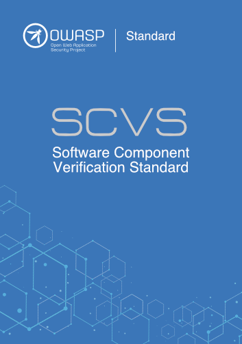

---

layout: col-sidebar
title: OWASP Software Component Verification Standard
site_side: true
tags: scvs, sca, component analysis, scrm, cscrm, software transparency, sbom, supply chain, software supply chain
level: 2
type: documentation
pitch: SCVS is a framework for identifying activities, controls, and best practices, which can help in identifying and reducing risk in a software supply chain.

---

The Software Component Verification Standard (SCVS) is a community-driven effort to
establish a framework for identifying activities, controls, and best practices, which can help in identifying and
reducing risk in a software supply chain.

Managing risk in the software supply chain is important to reduce the surface area of systems vulnerable to exploits,
and to measure technical debt as a barrier to remediation. 
 

Measuring and improving software supply chain assurance is crucial for success. Organizations with supply chain visibility
are better equipped to protect their brand, increase trust, reduce time-to-market, and manage costs in the event of a
supply chain incident.
 
Raising the bar for supply chain assurance requires the active participation of
risk managers, mission owners, and business units like legal and procurement, which have not traditionally been involved
with technical implementation. 

Determination of risk acceptance criteria is not a problem that can be solved by enterprise tooling: it is up to risk
managers and business decision makers to evaluate the advantages and trade-offs of security measures based on system
exposure, regulatory requirements, and constrained financial and human resources. Mandates that are internally
unachievable, or that bring development or procurement to a standstill, constitute their own security and institutional
risks. 

SCVS is designed to be implemented incrementally, and to allow organizations to
phase in controls at different levels over time.

### SCVS has the following goals:

* Develop a common set of activities, controls, and best-practices that can reduce risk in a software supply chain
* Identify a baseline and path to mature software supply chain vigilance

### Availability

SCVS is available (in English) as PDF, Word (docx), JSON, or XML. These artifacts can be found in the projects
[GitHub releases](https://github.com/OWASP/Software-Component-Verification-Standard/releases). It can also be 
[read online via GitBook](https://owasp-scvs.gitbook.io/scvs/).

### Translations

The project maintainers are actively looking for volunteers to translate SCVS into a number of languages. Please 
reach out on the projects Slack channel or on GitHub if interested.

