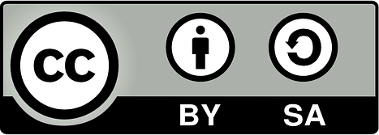

### Project Classification

### Downloads

Coming Q2 2020

### External Resources

* [GitHub](https://github.com/OWASP/Software-Component-Verification-Standard)
* [Slack](https://owasp.slack.com/channels/project-scvs) - [invite](https://dependencytrack.org/slack/invite)
* [Twitter](https://twitter.com/OWASP_SCVS)

### Licensing

