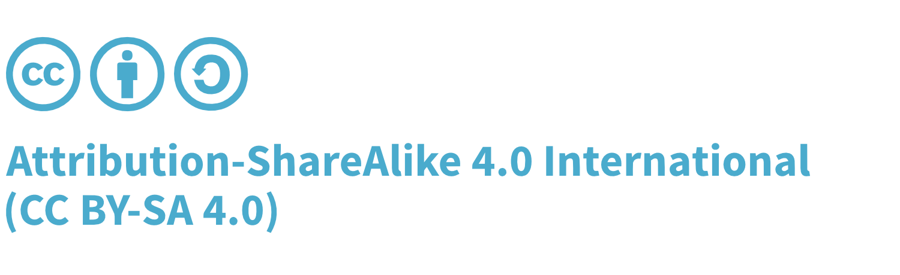

### Information
* <i class="fas fa-flask" style="font-size: 1.2em; color:#FFA500;"></i>Labs Project
* <i class="fas fa-book" style="font-size: 1.2em; color:#233e81;"></i>Documentation
* <i class="fas fa-toolbox" style="font-size: 1.2em; color:#233e81;"></i>Builder 
* <i class="fas fa-shield-alt" style="font-size: 1.2em; color:#233e81;"></i>Defender

### Get SCVS

* [Download](https://github.com/OWASP/Software-Component-Verification-Standard/releases)
* [Read online](https://owasp-scvs.gitbook.io/scvs/)

### External Resources

* [GitHub](https://github.com/OWASP/Software-Component-Verification-Standard)
* [Slack](https://owasp.slack.com/channels/project-scvs) - [invite](https://owasp-slack.herokuapp.com/)
* [Twitter](https://twitter.com/OWASP_SCVS)

### Licensing

